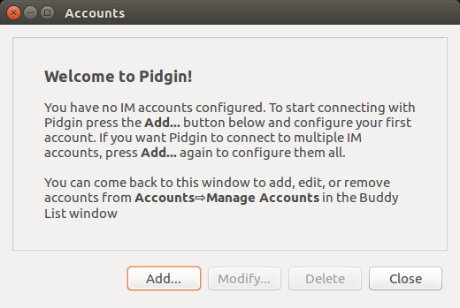
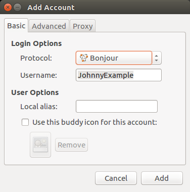
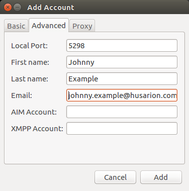
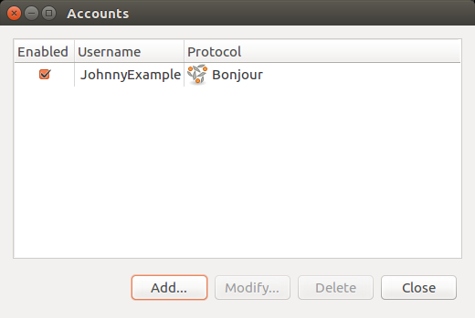
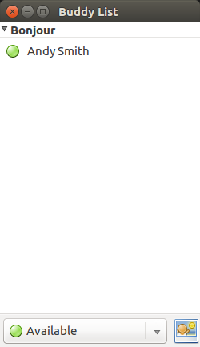
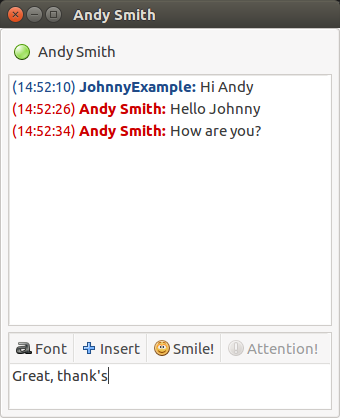

# Husarnet chat # 

1. Install avahi and pidgin:
`sudo apt install avahi-daemon avahi-utils pidgin`

2. Edit avahi configuration:
`sudo nano /etc/avahi/avahi-daemon.conf`

Find line:

`#allow-interfaces=eth0`

and change it to:

`allow-interfaces=hnetl2`

3. Restart avahi:

`sudo systemctl restart avahi-daemon.service`

4. You can check if avahi is active:

`avahi-browse -avt`

You should get output similar to:
```
Server version: avahi 0.6.32-rc; Host name: zb-t1.local
E Ifce Prot Name                                          Type                 Domain
: Cache exhausted
: All for now
```
There should be no services in the list, as we did not start any.

5. Start chat client:

`pidgin`

You will be welcomed with account configuration window:


Select "Add..." button and proceed to new window:



In "Add account" window you can set up your personal data. From "Protocol" drop down menu choose: "Bonjour" and in "Username" field type your desired username.

You can proceed to "Advanced" tab. Do not modify "Local port" value, you can fill other fields if you wish.



When you are done with account settings push "Add" buttton to finish. Your account is now visible in "Accounts" window, you can close it.



Open new terminal window and scan for avahi services:

`avahi-browse -avt`

You should get output similar to:

```
Server version: avahi 0.6.32-rc; Host name: zb-t1.local
E Ifce Prot Name                                          Type                 Domain
+ hnetl2 IPv6 JohnnyExample@zb-t1                           iChat Presence       local
: Cache exhausted
: All for now
```

6. Your account is redy to go. When other chat users configure their accounts, you will see them in "Buddy list" window.



You can also use `avahi-browse` to detect users available in the network:

```
Server version: avahi 0.6.32-rc; Host name: zb-t1.local
E Ifce Prot Name                                          Type                 Domain
+ hnetl2 IPv6 AndyS@iros-rosbot                             iChat Presence       local
+ hnetl2 IPv6 JohnnyExample@zb-t1                           iChat Presence       local
: Cache exhausted
: All for now
```

7. To start conversation, double click user name, you will see conversation window:

